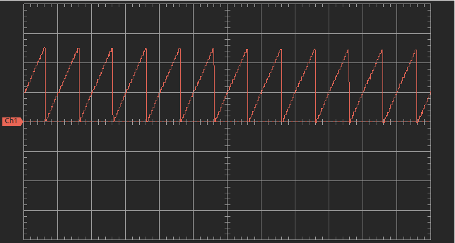

# Speaker

Generate audio output for a speaker for Particle devices (Photon, Electron)

## Usage

Connect a speaker amplifier like [this one from Adafruit](https://www.adafruit.com/product/2130) to the digital to analog converter `DAC` pin of a Photon or Electron and run this code to play a sawtooth wave.

```
#include "speaker.h"

uint16_t bufferSize = 128;
Speaker speaker(bufferSize);

void setup() {
  uint16_t audioFrequency = 22050; // Hz
  speaker.begin(audioFrequency);
}

uint16_t audioSignal = 0;

void loop() {
  if (speaker.ready()) {
    uint16_t *buffer = speaker.getBuffer();
    // Produces a 1 kHz sawtooth wave
    for (uint16_t i = 0; i < bufferSize; i++) {
      buffer[i] = audioSignal;
      audioSignal += 2267;
      if (audioSignal > 50000) {
        audioSignal = 0;
      }
    }
  }
}
```

<br>
A 1 kHz sawtooth signal played from a Photon

See [complete example](examples/sawtooth/sawtooth.ino) in the examples directory.

## Reference

### `Speaker`

`Speaker speaker(bufferSize);`

Creates a speaker object with 2 buffers of the same size (double buffering).

While the library plays the sound in one buffer your application fills the second one.

The larger the buffer, the more delay there will be in between your application filling a buffer and it being played. The shorter the buffer, the less time your code has to fill the next buffer. Short buffers work best for real-time audio synthesis and longer buffer for playback from an SD card.

The application has `bufferSize / audioFrequency` seconds to fill the next buffer. For example, this is 2.9 ms at 44100 Hz with a 128 sample buffer.

The copy from memory to the DAC is done using direct memory access (DMA) so the CPU is free to do other tasks.

### `begin`

`speaker.begin(audioFrequency);`

Sets up the `DAC` pin and `TIM6` timer to trigger at the correct audio freqency. Common frequencies are 44100 Hz, 22050 Hz, 11025 Hz and 8000 Hz.

Starts playing the content of the buffer immediately so you may want to fill the audio buffer before calling `speaker.begin`. The buffer is zero by default so not filling the buffer first would still be OK.

_Note: Do not call `analogWrite(DAC, ...);` when using this library since it completely takes over the DAC peripheral.`_

### `end`

`speaker.end();`

Stops the audio playback.

### `ready`

`bool readyForMoreAudio = speaker.ready();`

Returns `true` once when the audio buffer is ready to be filled with more audio samples.  Will return `false` when called again until the buffer has finished playing.

### `getBuffer`

`uint16_t *buffer = speaker.getBuffer();`

Returns a pointer to an array of `bufferSize` audio samples.

The audio samples are 16 bit integers but the DAC on the Photon and Electron only has 12 bits to the least significant 4 bits are ignored.

You must only write to this array when `speaker.ready()` is `true`.

## Resource Utilization

This library uses the `DAC1` digital to analog converter, `TIM6` basic timer and `DMA1` stream 5 direct memory access.

## References

Read the [STM Application note AN3126 - Audio and waveform generation using the DAC in STM32 microcontrollers](http://www.st.com/content/ccc/resource/technical/document/application_note/05/fb/41/91/39/02/4d/1e/CD00259245.pdf/files/CD00259245.pdf/jcr:content/translations/en.CD00259245.pdf) for more background on using the DAC and DMA for audio generation.

## License
Copyright 2016 Julien Vanier

Released under the MIT license
